<div align="center">


<br/><br/>

<a href="https://wa.me/62XXXXXXXXXX">

</a>
<a href="#">

</a>
<a href="#">

</a>
<a href="mailto:mimpimudacreative@gmail.com">

</a>

</div>

---

# &#127760; ABOUT US

```bash
> whoami

Company     : Rimba Raya ISP
Managed by  : CV Mimpi Muda Creative
Service     : Fiber Optic Internet (FTTH)
Focus       : Fast, stable & reliable connectivity
Motto       : "Connecting communities, empowering progress."
```

**Rimba Raya ISP** delivers **fast, stable, and reliable** internet connectivity powered by modern fiber optic infrastructure — backed by a network monitoring system we build and operate ourselves.

---

# &#128225; SERVICE PLANS

<div align="center">

| Plan | Speed | Best For |
|:----:|:-----:|:---------|
| &#129352; **Basic**    | `10 Mbps` | Browsing &amp; social media |
| &#129351; **Standard** | `20 Mbps` | Streaming &amp; work from home |
| &#129352; **Premium**  | `30 Mbps` | Family &amp; gaming |
| &#128142; **Pro**      | `50 Mbps` | Business &amp; multiple devices |

</div>

---

# &#10024; WHY CHOOSE US

<div align="center">

|  |  |
|:--:|:--|
| &#9889; | **Fiber Optic Speed** &mdash; direct fiber connection to your home |
| &#128246; | **Stable Connection** &mdash; a reliable, low-latency network |
| &#128736;&#65039; | **Responsive Support** &mdash; a technical team ready to help |
| &#129309; | **Customer First** &mdash; friendly, people-powered service |

</div>

---

# &#128736; OUR TECHNOLOGY

> We don't just provide internet &mdash; we **build &amp; operate our own network management (NOC) system.**

<div align="center">

### &#127760; PLATFORM &amp; SYSTEMS


<br/><br/>

### &#128225; NETWORK &amp; AUTOMATION


</div>

---

# &#9889; WHAT WE BUILD

* &#128202; **NOC Dashboard** &mdash; **real-time** network monitoring (customer map, online/offline triggers, network health)
* &#129302; **Telegram Technician Bot** &mdash; check customer connection &amp; location directly from the field
* &#128451;&#65039; **Centralized Customer Database** &mdash; installation, device &amp; location data
* &#128225; **MikroTik Integration** &mdash; automatic PPPoE session &amp; ONT signal monitoring

---

# &#128295; HOW TO GET CONNECTED

```mermaid
graph LR
  A["&#128222; Contact Us"] --> B["&#128205; Site Survey"]
  B --> C["&#128736;&#65039; Installation"]
  C --> D["&#127760; Get Online"]
```

<div align="center">



</div>

**Getting connected is simple** &mdash; reach out, we survey your location, our technician installs the fiber, and you're ready to enjoy a fast connection.

---

# &#128153; OUR COMMITMENT

<div align="center">


</div>

We are committed to keeping our customers **connected and cared for**. Every connection is monitored, every issue is handled quickly by our team, and every customer is treated like a neighbor &mdash; because that's exactly who they are.

---

# &#128173; OUR PHILOSOPHY

<div align="center">

<br/>


<br/><br/>


</div>

---

<div align="center">


### &#9889; "CONNECTING COMMUNITIES. EMPOWERING PROGRESS."


<sub>&#169; 2026 <b>Rimba Raya ISP</b> &mdash; CV Mimpi Muda Creative</sub>

</div>
